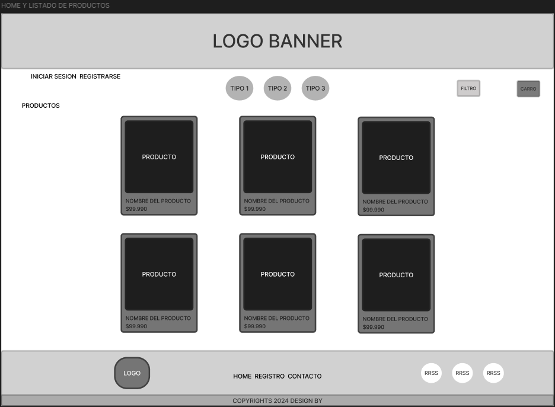
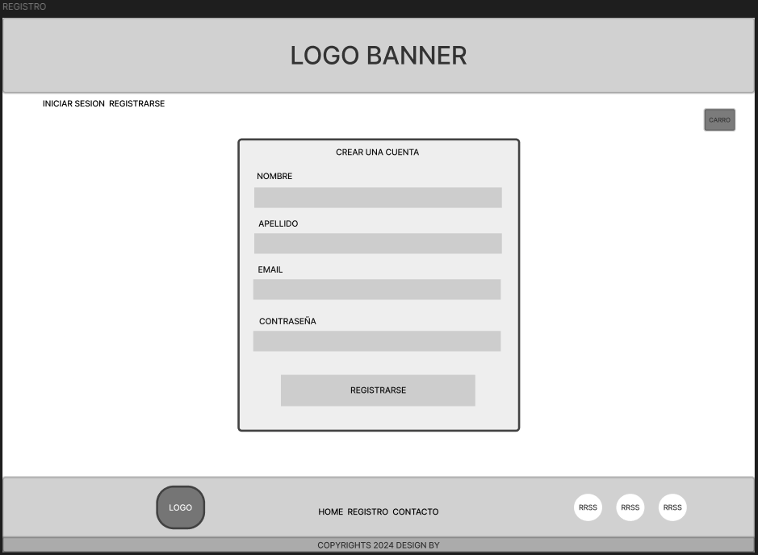
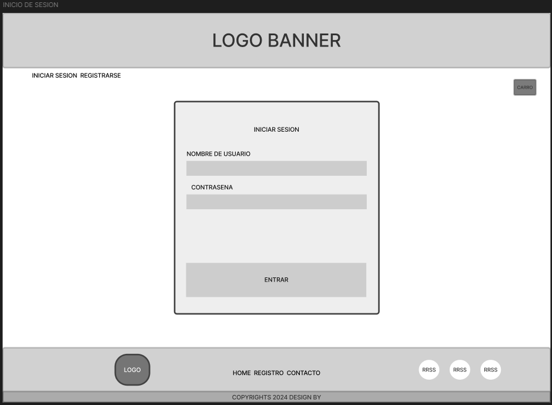
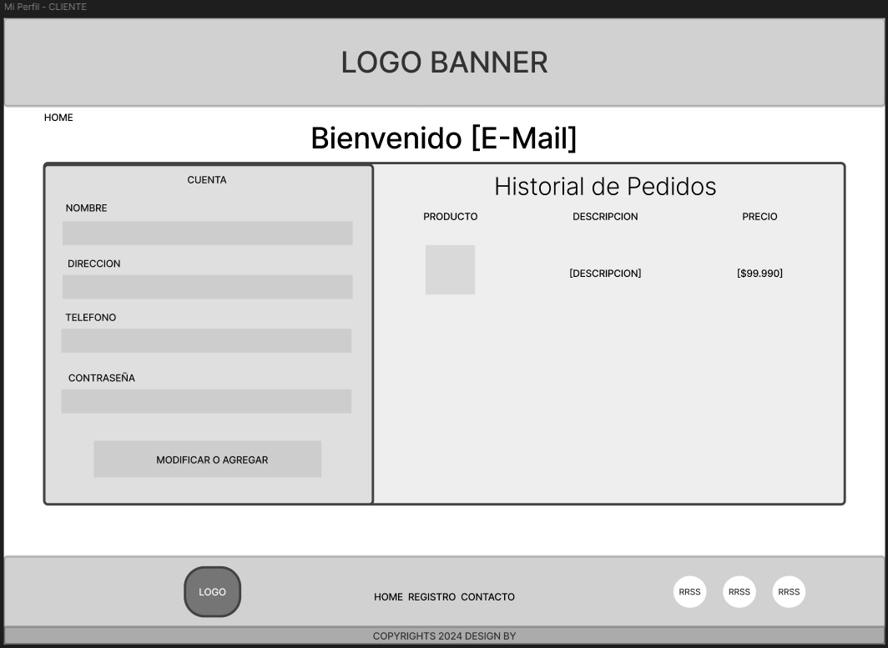
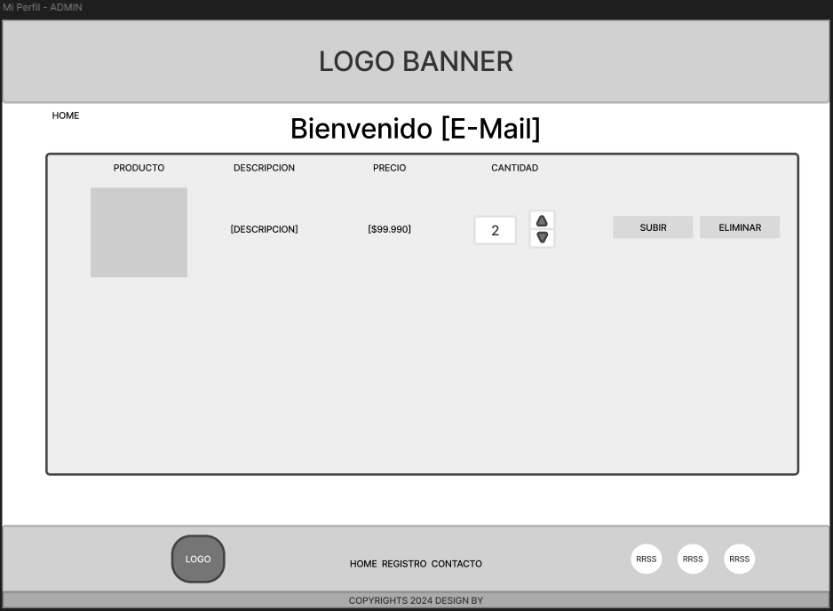
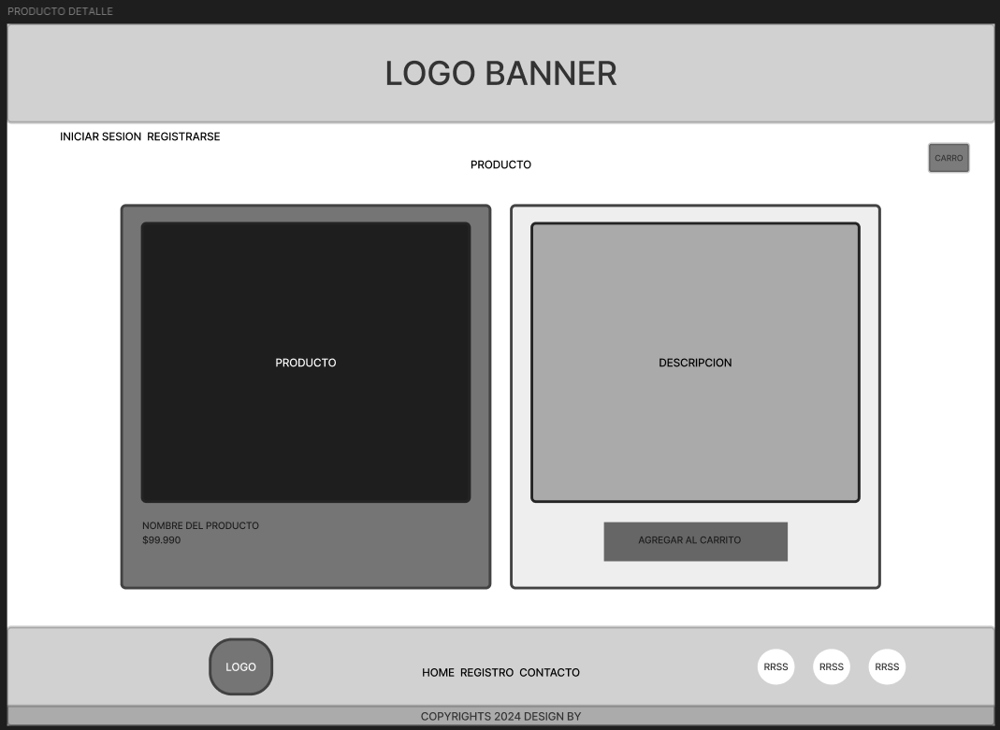

# Hito 1 - Diseño y Prototipo

## 1. Diseño de la Interfaz Gráfica

Se ha diseñado un boceto de las vistas del proyecto. Las pantallas consideradas son:

-   Página principal y Galeria de Publicaciones

    

-   Registro de Usuarios

    

-   Inicio de Sesión

    
       
-   Mi perfil vista Usuario

    
    
-   Mi perfil vista Administrador y formulario para subir Producto

    
    
-   Vista de detalle de Producto

    

-   Vista de Carrito de venta

    
    

---

## 2. Definición de la Navegación entre Vistas

El Marketplace cuenta con vistas públicas y privadas:

-   **Vistas públicas**:

    -   Página principal
    -   Registro de usuarios
    -   Inicio de sesión

-   **Vistas privadas**:
    -   Mi perfil
    -   Formulario para crear una publicación
    -   Galería de publicaciones
    -   Detalle de una publicación

La navegación entre estas vistas está definida de la siguiente forma:

-   Un usuario no autenticado puede acceder libremente a las vistas públicas.
-   Un usuario autenticado tiene acceso a las vistas privadas.

---

## 3. Listado de Dependencias

Las dependencias a utilizar en el proyecto son las siguientes:

-   Framework CSS: Bootstrap
-   JavaScript: React.js
-   Backend: Node.js con Express
-   Base de datos: PostgreSQL
-   Autenticación: JWT para manejo de sesiones
-   Librería de íconos: Font Awesome

---

## 4. Diseño de las Tablas de la Base de Datos

A continuación se presenta el diseño de las tablas de la base de datos y sus relaciones.

### **Usuarios**

```sql
CREATE TABLE usuarios (
  id                BIGINT          PRIMARY KEY GENERATED ALWAYS AS IDENTITY,
  nombre            VARCHAR(100)    NOT NULL,
  email             VARCHAR(255)    UNIQUE NOT NULL,
  contrasena        VARCHAR(255)    NOT NULL,
  direccion         VARCHAR(255),
  telefono          VARCHAR(20),
  fecha_registro    TIMESTAMP WITH TIME ZONE DEFAULT NOW(),
  estado            CHAR(1)         DEFAULT '1', -- Estado de la cuenta (activo/inactivo)
  rol               VARCHAR(20)     NOT NULL -- Rol del usuario (admin o cliente)
);
```

### **Fragancias**

```sql
CREATE TABLE fragancias (
  id                BIGINT          PRIMARY KEY GENERATED ALWAYS AS IDENTITY,
  nombre            VARCHAR(100)    NOT NULL UNIQUE,
  descripcion       VARCHAR(255)
);

```


### **Productos**

```sql
CREATE TABLE productos (
  id                BIGINT          PRIMARY KEY GENERATED ALWAYS AS IDENTITY,
  nombre            VARCHAR(100)    NOT NULL,
  descripcion       VARCHAR(255),
  precio            DECIMAL(10, 2)  NOT NULL,
  descuento         DECIMAL(5, 2)   DEFAULT 0.00, -- Porcentaje de descuento
  stock             INT NOT NULL,
  fragancia_id      BIGINT          REFERENCES fragancias(id),
  imagen            VARCHAR(1000),
  fecha_creacion    TIMESTAMP WITH TIME ZONE DEFAULT NOW(),
  fecha_modificacion TIMESTAMP WITH TIME ZONE DEFAULT NOW() ON UPDATE NOW()
);

```


### **Pedidos**

```sql
CREATE TABLE pedidos (
  id                BIGINT          PRIMARY KEY GENERATED ALWAYS AS IDENTITY,
  usuario_id        BIGINT          REFERENCES usuarios(id),
  fecha             TIMESTAMP WITH TIME ZONE DEFAULT NOW(),
  total             DECIMAL(10, 2)  NOT NULL,
  estado            CHAR(1)         DEFAULT '0', -- Estado del pedido (pendiente/completado)
  metodo_pago       VARCHAR(50)     NOT NULL -- Tipo de pago (tarjeta, PayPal)
);

```


### **Detalles de Pedido**

```sql
CREATE TABLE detalles_pedido (
  id                BIGINT          PRIMARY KEY GENERATED ALWAYS AS IDENTITY,
  pedido_id         BIGINT          REFERENCES pedidos(id),
  producto_id       BIGINT          REFERENCES productos(id),
  cantidad          INT             NOT NULL,
  precio_unitario   DECIMAL(10, 2)  NOT NULL
);

```


### **Historial de Pedidos**

```sql
CREATE TABLE historial_pedidos (
  id                BIGINT          PRIMARY KEY GENERATED ALWAYS AS IDENTITY,
  pedido_id         BIGINT          REFERENCES pedidos(id),
  estado            CHAR(1),
  fecha_cambio      TIMESTAMP WITH TIME ZONE DEFAULT NOW()
);

```


> **Herramienta utilizada**: [draw.io](https://app.diagrams.net/) >
>
> Diagrama Entidad Relacion 

---

## 5. Contrato de Datos de la API REST

El contrato de la API REST incluirá los siguientes endpoints:

# API Endpoints

## 1. Crear un nuevo usuario

**Método:** `POST`  
**URL:** `/api/usuarios`  
**Descripción:** Crea un nuevo usuario en la tienda.

### Request Body:
```json
{
    "nombre": "string",
    "email": "string",
    "contraseña": "string",
    "direccion": "string"
}
```

### Response:

**Código 201 Created**

```json {
{    
    "id": "string",
    "nombre": "string",
    "email": "string",
    "direccion": "string"
}
```

**Código 400 Bad Request**

```
{
  "error": "string"
}
```

## 2. Iniciar sesión de un usuario

**Método:** `POST`
**URL:** `/api/login`
**Descripción:** Inicia sesión de un usuario existente.

### Request Body:

```json{
{
    "email": "string",
    "contraseña": "string"
}
```

### Response:

**Código 200 OK**

```
{
    "token": "string",
    "usuario": {
        "id": "string",
        "nombre": "string",
        "email": "string"
    }
}
```

### Código 401 Unauthorized

```json{
{
    "error": "string"
}
```

## 3. Obtener lista de perfumes

**Método:** `GET`
**URL:** `/api/perfumes`
**Descripción:** Muestra una lista de todos los perfumes disponibles.

### Response:

**Código 200 OK**

```
[
    {
        "id": "number",
        "nombre": "string",
        "marca": "string",
        "precio": "number",
        "imagen": "string"
    }
]
```

## 4. Obtener detalles de un perfume

**Método:** `GET`
**URL:** `/api/perfumes/{id}`
**Descripción:** Muestra los detalles de un perfume específico.

### Response:

**Código 200 OK**

```
{
    "id": "number",
    "nombre": "string",
    "marca": "string",
    "precio": "number",
    "descripcion": "string",
    "imagen": "string",
    "cantidad": "number"
}
```

**Código 404 Not Found**

```
{
  "error": "string"
}

```

## 5. Agregar un nuevo perfume

**Método:** `POST`
**URL:** `/api/perfumes`
**Descripción:** Agrega un nuevo producto a la tienda.

### Request Body:

```
{
    "nombre": "string",
    "marca": "string",
    "precio": "number",
    "descripcion": "string",
    "imagen": "string",
    "cantidad": "number"
}
```

### Response:

**Código 201 Created**

```
{
    "id": "number",
    "nombre": "string",
    "marca": "string",
    "precio": "number",
    "descripcion": "string",
    "imagen": "string",
    "cantidad": "number"
}
```

**Código 400 Bad Request**

```
{
  "error": "string"
}
```

------

## 6. Actualizar un perfume existente

**Método:** `PUT`
**URL:** `/api/perfumes/{id}`
**Descripción:** Actualiza la información de un producto existente.

### Request Body:

```
{
    "nombre": "string",
    "marca": "string",
    "precio": "number",
    "descripcion": "string",
    "imagen": "string",
    "cantidad": "number"
}
```

### Response:

**Código 200 OK**

```
{
    "id": "number",
    "nombre": "string",
    "marca": "string",
    "precio": "number",
    "descripcion": "string",
    "imagen": "string",
    "cantidad": "number"
}
```

**Código 400 Bad Request**

```
{
  "error": "string"
}
```

---

**Requerimientos**:

1. Boceto de las vistas del proyecto.
2. Definir la navegación entre vistas.
3. Enlistar dependencias del proyecto.
4. Diseño de las tablas de la base de datos.
5. Contrato de datos de la API REST.
