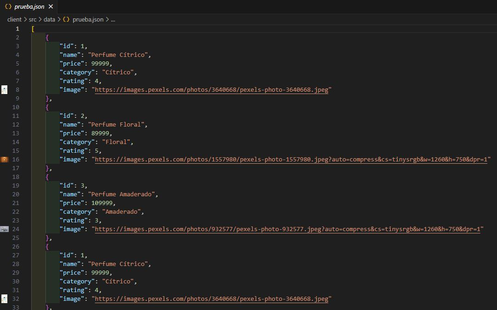

# Hito 2 - Desarrollo Front End

## 1. Crear un nuevo proyecto usando npx e instalar las dependencias.

---

## 2. Usar los componentes para la reutilización de código y separación de secciones integrando los hooks necesarios que correspondan.

 

---

## 3. Usar React Router para la navegación de vistas por rutas.

---

## 4. Utilizar Context API para el manejo de estado global.

---

## 5. Preparar la aplicación para el consumo de datos siguiendo el contrato definido en el hito anterior.

 

---

