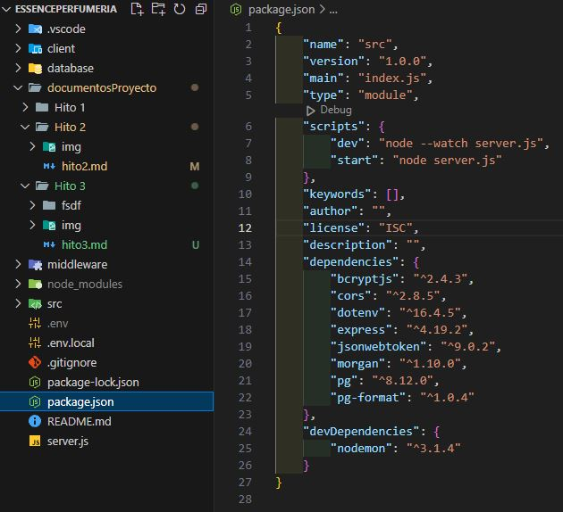
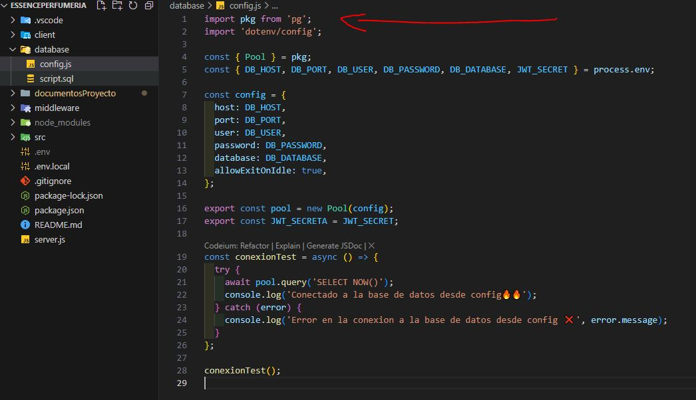
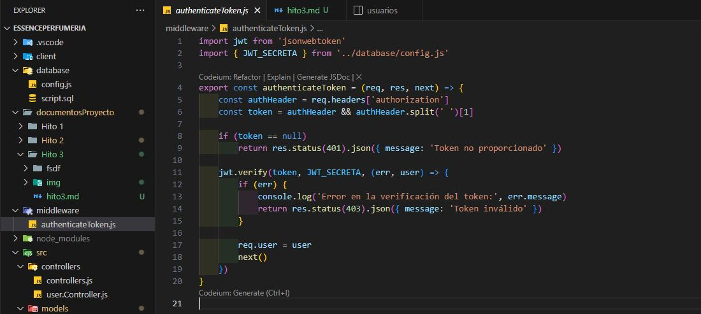
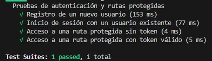
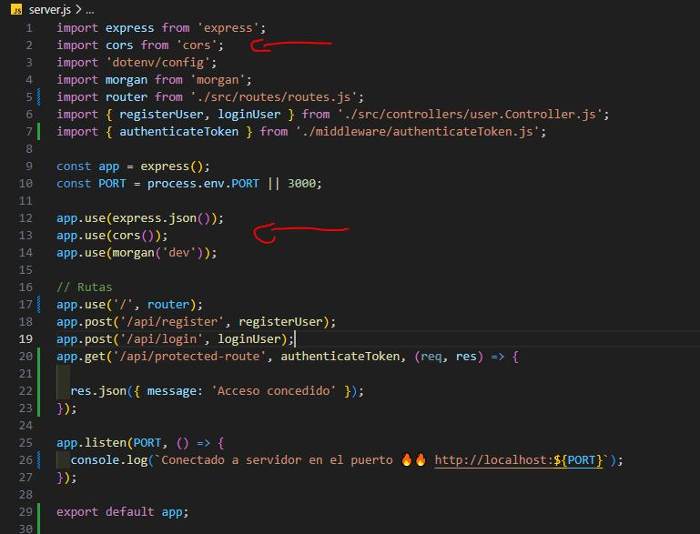
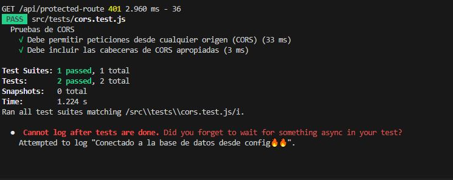
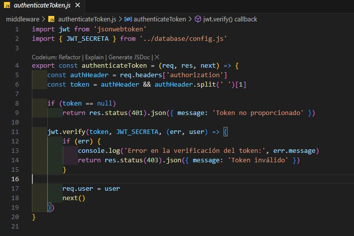

# Hito 3 - Desarrollo Back End

## 1. Crear un nuevo proyecto de npm e instalar todas las dependencias que necesitarás.

---

## 2. Utilizar el paquete pg para gestionar la comunicación con la base de datos PostgreSQL.

---

## 3. Implementar la autenticación y autorización de usuarios con JWT.

 

---

## 4. Usar el paquete CORS para permitir las consultas de orígenes cruzados.

 

---

## 5. Utilizar middlewares para validar las credenciales o token en cabeceras en las rutas que aplique.

 

---

## 6. Realizar test de por lo menos 4 rutas de la API REST comprobando los códigos de estados de diferentes escenarios. (Falta las rutas productos para poder completar este punto)

 

---